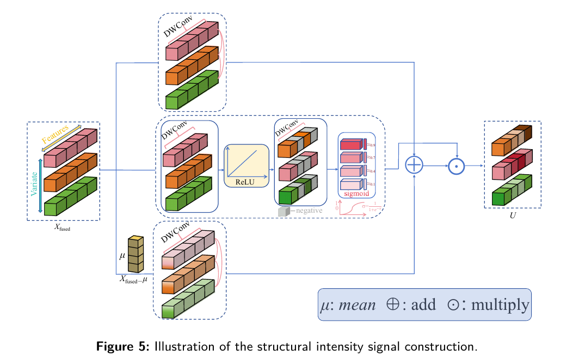
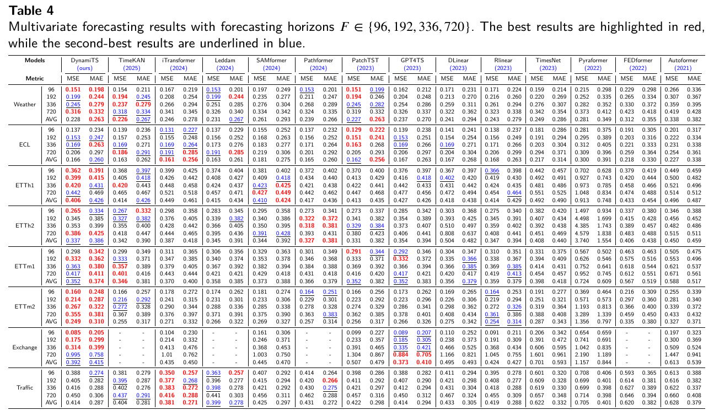
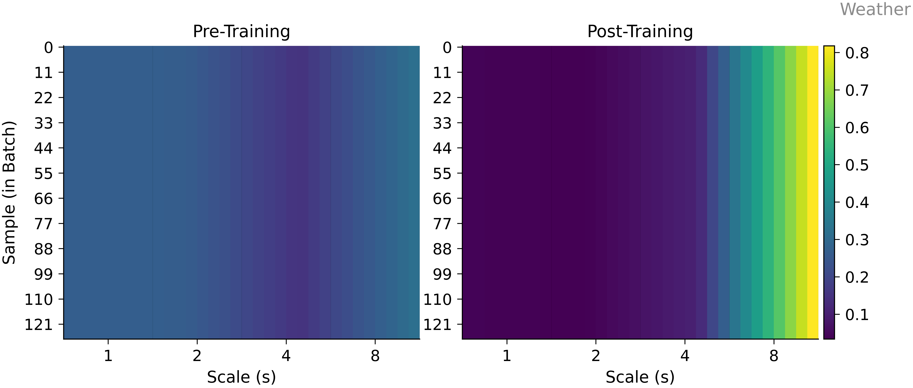

# 🌌 DynamiTS 

### DynamiTS: A Structure-Guided Framework for Multivariate Time Series Forecasting via Adaptive Multi-Scale Fusion and Dynamic Patch Expansion

<p align="center">
  <b>Adaptive Scale Selection · Long-term Forecasting · Mixture-of-Experts · Robust Temporal Modeling</b>
</p>

<p align="center">
  
  
  
  
</p>

<p align="center">
  <a href="#-overview">Overview</a> •
  <a href="#-architecture">Architecture</a> •
  <a href="#-results">Results</a> •
  <a href="#-usage">Usage</a> •
  <a href="#-citation">Citation</a>
</p>

</div>

---

## 🔥 Highlights

<table>
<tr>
<td width="33%" align="center">

### 🧠 Adaptive Multi-Scale Fusion
Adaptively aggregate multi-resolution temporal representations.

</td>
<td width="33%" align="center">

### ⚡ Structure-Guided Dynamic Patch Expansion

Preserve local structural continuity through adaptive patch boundary adjustment

</td>
<td width="33%" align="center">

### 📈 Temporal-Aware DLinear Mixture of Experts

Capture variable-specific temporal dynamics with expert routing

</td>
</tr>
</table>

---


## 📌 Introduction

This repository provides the official implementation of **DynamiTS**, a deep learning model for long-term time series forecasting.


## ✨ Overview

**DynamiTS** is a deep learning framework designed for **long-term time series forecasting**.  
It introduces an adaptive multi-scale modeling strategy to capture both short-term fluctuations and long-term temporal dependencies.

Our model is built on three key ideas:

- **Adaptive Multi-Scale Fusion** for dynamically aggregating multi-resolution temporal representations.
- **Structure-Guided Dynamic Patch Expansion** for preserving local structural continuity through adaptive patch boundary adjustment.
- **Temporal-Aware DLinear Mixture of Experts** for capturing variable-specific temporal dynamics with expert routing.

<p align="center">
  
</p>

<p align="center">
  
</p>


## 🏗 Architecture

<p align="center">
  
</p>

## 📊 Main Results

### Main Forecasting Results
<p align="center">
  
</p>


---


## 🧪 Selector Weight Analysis

<p align="center">
  
</p>

The learned selector weights reveal how the model adaptively focuses on different temporal scales for each input sample.

---

## ⚙️ Installation

```bash
pip install -r requirements.txt
```

---

## 🚀 Usage

### Train and evaluate on Traffic
```bash
bash ./scripts/ETTh1/ETTh1.sh
bash ./scripts/ETTh2/ETTh2.sh
bash ./scripts/ETTm1/ETTm1.sh
bash ./scripts/ETTm2/ETTm2.sh
bash ./scripts/ECL/ECL.sh
bash ./scripts/Traffic/Traffic.sh
bash ./scripts/Weather/Weather.sh

## 📁 Project Structure

```text
YourProject/
├── README.md
├── requirements.txt
├── run.py
├── models/
│   └── YourModelName.py
├── layers/
├── scripts/
│   └── Traffic/
│       └── your_model.sh
├── checkpoints/
├── test_results/
└── figures/
    ├── banner.png
    ├── overview.png
    ├── architecture.png
    ├── results.png
    ├── prediction_curve.png
    └── selector_weights.png
```
---


## 🙏 Acknowledgement

This project is inspired by the following excellent repositories:

- iTransformer
- PatchTST
- TimesNet
- Autoformer
- Informer
---

## 📬 Contact

For questions or suggestions, please contact:

```text
sunyujuan@ldu.edu.cn
```

---

<div align="center">

### ⭐ Star this repository if you find it useful.

</div>
