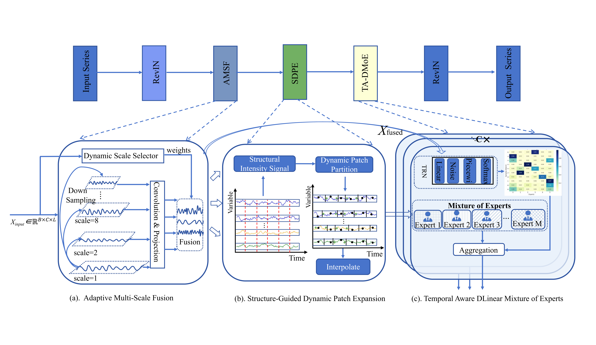

# DynamiTS 

<p align="center">
  
</p>

<p align="center">
  <b> A Structure-Guided Framework for Multivariate Time
Series Forecasting via Adaptive Multi-Scale Fusion and Dynamic
Patch Expansion.</b>
</p>

<p align="center">
  
  
  
  
</p>

---

## 📌 Introduction

This repository provides the official implementation of **YourModelName**, a deep learning model for long-term time series forecasting.

Our method is designed to improve forecasting performance by introducing:

- Multi-scale temporal modeling
- Adaptive feature mixing
- Efficient forecasting architecture
- Robust generalization across datasets

---

## 🔥 News

- **2026.05**: Code released.
- **2026.05**: Checkpoints and scripts are available.
- **2026.04**: Paper accepted by XXX.

---

## 🧠 Overall Architecture

<p align="center">
  
</p>

The proposed framework consists of three main components:

1. **Temporal Encoder**: captures historical temporal dependencies.
2. **Multi-scale Mixing Module**: extracts patterns from different temporal resolutions.
3. **Forecasting Head**: generates future predictions.

---

## ⚙️ Installation

Create a new conda environment:

```bash
conda create -n your_model python=3.8
conda activate your_model
```

Install dependencies:

```bash
pip install -r requirements.txt
```

---

## 🚀 Usage

### Train and evaluate on Traffic

```bash
bash ./scripts/Traffic/your_model.sh
```

### Train and evaluate on Weather

```bash
bash ./scripts/Weather/your_model.sh
```

You can also run the model manually:

```bash
python run.py \
  --model YourModelName \
  --data Traffic \
  --seq_len 512 \
  --pred_len 192 \
  --batch_size 32 \
  --learning_rate 0.0001
```

---

## 📊 Main Results

### Multivariate long-term forecasting results

| Dataset | Pred Len | MSE | MAE |
|---|---:|---:|---:|
| Traffic | 96  | 0.XXX | 0.XXX |
| Traffic | 192 | 0.XXX | 0.XXX |
| Traffic | 336 | 0.XXX | 0.XXX |
| Traffic | 720 | 0.XXX | 0.XXX |
| Weather | 96  | 0.XXX | 0.XXX |
| Weather | 192 | 0.XXX | 0.XXX |

<p align="center">
  
</p>

---

## 📈 Visualization

<p align="center">
  
</p>

The figure above shows the comparison between ground truth and predicted values.

---

## 📁 Checkpoints

The trained checkpoints are saved in:

```text
./checkpoints/
```

Example:

```text
checkpoints/
└── Traffic_512_192_YourModelName/
    └── checkpoint.pth
```

To evaluate using a saved checkpoint:

```bash
python run.py \
  --is_training 0 \
  --model YourModelName \
  --data Traffic \
  --seq_len 512 \
  --pred_len 192
```

---

## 🧪 Reproducibility

To reproduce the main results, please run:

```bash
bash ./scripts/Traffic/your_model.sh
bash ./scripts/Weather/your_model.sh
bash ./scripts/ETT/your_model.sh
```

The random seed is fixed in the training script for fair comparison.

---

## 📝 Citation

If you find this repository useful, please cite our work:

```bibtex
@article{yourmodel2026,
  title={YourModelName: A Powerful Model for Time Series Forecasting},
  author={Your Name and Coauthor Name},
  journal={arXiv preprint arXiv:xxxx.xxxxx},
  year={2026}
}
```

---

## 🙏 Acknowledgement

We appreciate the following repositories:

- iTransformer
- PatchTST
- Autoformer
- TimesNet

---

## 📬 Contact

For questions or suggestions, please contact:

```text
your_email@example.com
```


<div align="center">

# 🌌 DynamiTS 

### DynamiTS: A Structure-Guided Framework for Multivariate Time Series Forecasting via Adaptive Multi-Scale Fusion and Dynamic Patch Expansion
<p align="center">
  
</p>

<p align="center">
  <b>Adaptive Scale Selection · Long-term Forecasting · Mixture-of-Experts · Robust Temporal Modeling</b>
</p>

<p align="center">
  
  
  
  
</p>

<p align="center">
  <a href="#-overview">Overview</a> •
  <a href="#-architecture">Architecture</a> •
  <a href="#-results">Results</a> •
  <a href="#-usage">Usage</a> •
  <a href="#-citation">Citation</a>
</p>

</div>

---
## 📌 Introduction

This repository provides the official implementation of **DynamiTS**, a deep learning model for long-term time series forecasting.


## ✨ Overview

**DynamiTS** is a deep learning framework designed for **long-term time series forecasting**.  
It introduces an adaptive multi-scale modeling strategy to capture both short-term fluctuations and long-term temporal dependencies.

Our model is built on three key ideas:

- **Adaptive Multi-Scale Fusion** for dynamically aggregating multi-resolution temporal representations..
- **Structure-Guided Dynamic Patch Expansion** for preserving local structural continuity through adaptive patch boundary adjustment..
- **Temporal-Aware DLinear Mixture of Experts** for capturing variable-specific temporal dynamics with expert routing..

<p align="center">
  
</p>

---

## 🔥 Highlights

<table>
<tr>
<td width="33%" align="center">

### 🧠 Adaptive Scale Selection

Learns dynamic weights for different temporal scales instead of relying on fixed receptive fields.

</td>
<td width="33%" align="center">

### ⚡ Efficient Forecasting

Achieves competitive performance with a lightweight and easy-to-train architecture.

</td>
<td width="33%" align="center">

### 📈 Strong Generalization

Performs well across multiple forecasting horizons and benchmark datasets.

</td>
</tr>
</table>

---

## 🏗 Architecture

<p align="center">
  
</p>

The overall architecture consists of:

1. **Input Embedding**  
   Converts raw time series into latent temporal representations.

2. **Multi-scale Mixing Module**  
   Extracts temporal patterns from different scales.

3. **Adaptive Selector**  
   Learns sample-wise scale importance weights.

4. **Prediction Head**  
   Generates future forecasting results.

---

## 📊 Main Results

### Main Forecasting Results

| Dataset | Prediction Length | MSE ↓ | MAE ↓ | RMSE ↓ | MAPE ↓ | RSE ↓ |
|:---:|:---:|---:|---:|---:|---:|---:|
| Traffic | 96  | 0.XXX | 0.XXX | 0.XXX | 0.XXX | 0.XXX |
| Traffic | 192 | 0.XXX | 0.XXX | 0.XXX | 0.XXX | 0.XXX |
| Traffic | 336 | 0.XXX | 0.XXX | 0.XXX | 0.XXX | 0.XXX |
| Traffic | 720 | 0.XXX | 0.XXX | 0.XXX | 0.XXX | 0.XXX |
| Weather | 96  | 0.XXX | 0.XXX | 0.XXX | 0.XXX | 0.XXX |
| Weather | 192 | 0.XXX | 0.XXX | 0.XXX | 0.XXX | 0.XXX |

<p align="center">
  
</p>

---

## 📈 Visualization

<p align="center">
  
</p>

The visualization compares the predicted sequence with the ground-truth sequence on the test set.

---

## 🧪 Selector Weight Analysis

<p align="center">
  
</p>

The learned selector weights reveal how the model adaptively focuses on different temporal scales for each input sample.

---

## ⚙️ Installation

```bash
conda create -n your_model python=3.8
conda activate your_model
pip install -r requirements.txt
```

---

## 🚀 Usage

### Train and evaluate on Traffic

```bash
bash ./scripts/Traffic/your_model.sh
```

### Run manually

```bash
python run.py \
  --model YourModelName \
  --data Traffic \
  --seq_len 512 \
  --pred_len 192 \
  --batch_size 32 \
  --learning_rate 0.0001
```

### Test with checkpoint

```bash
python run.py \
  --is_training 0 \
  --model YourModelName \
  --data Traffic \
  --seq_len 512 \
  --pred_len 192
```

---

## 📁 Project Structure

```text
YourProject/
├── README.md
├── requirements.txt
├── run.py
├── models/
│   └── YourModelName.py
├── layers/
├── scripts/
│   └── Traffic/
│       └── your_model.sh
├── checkpoints/
├── test_results/
└── figures/
    ├── banner.png
    ├── overview.png
    ├── architecture.png
    ├── results.png
    ├── prediction_curve.png
    └── selector_weights.png
```

---

## 🧩 Checkpoints

The best checkpoint is saved automatically according to the validation loss.

```text
checkpoints/
└── Traffic_512_192_YourModelName/
    └── checkpoint.pth
```

During testing, the model loads:

```python
model.load_state_dict(torch.load(best_model_path))
```

---

## 📌 To-do List

- [x] Release training and testing code
- [x] Support Traffic dataset
- [x] Add visualization scripts
- [ ] Release pretrained checkpoints
- [ ] Add more benchmark datasets
- [ ] Add ablation study results

---

## 📝 Citation

If you find this repository helpful, please cite our work:

```bibtex
@article{yourmodel2026,
  title={YourModelName: A Multi-scale Adaptive Framework for Long-term Time Series Forecasting},
  author={Your Name and Coauthor Name},
  journal={arXiv preprint arXiv:xxxx.xxxxx},
  year={2026}
}
```

---

## 🙏 Acknowledgement

This project is inspired by the following excellent repositories:

- iTransformer
- PatchTST
- TimesNet
- Autoformer
- Informer

---

## 📬 Contact

For questions or suggestions, please contact:

```text
your_email@example.com
```

---

<div align="center">

### ⭐ Star this repository if you find it useful.

</div>
